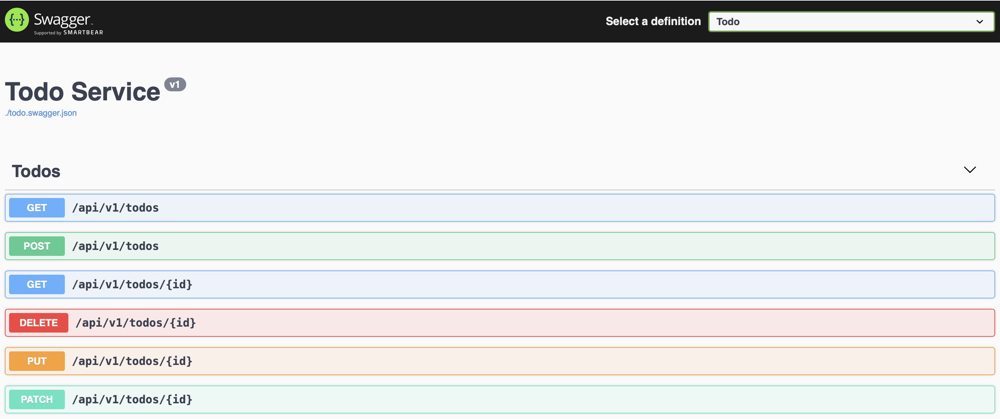

## Skeleton

Skeleton is a boilerplate, RESTful generator based on [Bima](https://github.com/KejawenLab/bima)

### Video

Check the [video](https://www.youtube.com/watch?v=zZPpDizZGIM)

### Requirements

- Go 1.17 or above

- Git

- [Taskfile](taskfile.dev)

- [gRPC Gateway](https://github.com/grpc-ecosystem/grpc-gateway)

- RDBMS or MongoDB for database storage

- Elasticsearch (Optional)

- MongoDB (for Logging Extension - Optional)

- RabbitMQ (Optional)

### Basic Usage

- Download using skeleton using git by running `git clone https://github.com/KejawenLab/skeleton.git`

- Download dependencies using `task update` command

- Create database

- Copy `env.example` to `.env` and changes some value

- Run using `task serve`


- Open your browser and open `http://localhost:7777` or port assigned by you


### Create New Module

- Run `task module -- add <name>`

- Follow the instructions 


- Bima will generate `todos` folder as your module space, creating `protos/todo.proto`, register your module in `configs/modules.yaml` and register your Dependency Injection defined in `todos/dic.go` to `provider.go`


- Refresh your browser



### Register Request Filter

By default, you can not filter anything by query params. All of query params is ignored until you add filter by registering it in `configs/listeners.yaml`. Bima provide some filters depend on driver that you choose. For example, when you choose mysql, you can add in `configs/listeners.yaml` `filter:gorm` filter. Your listener file will be like below:

```yaml
listeners:
    - filter:gorm

```

Now, you can rerun your service and try `/api/v1/todos?fields[]=task&values[]=xxx`

Gorm filter defined in [gorm_filter.go](https://github.com/KejawenLab/bima/blob/main/listeners/paginations/gorm_filter.go), if you think the logic is not covering your needs, you can create your own filter by follow the `Listener` interface that decribed below

```go
Listener interface {
    Handle(event interface{}) interface{}
    Listen() string
    Priority() int
}
```

and then you can registering it into Dependency Injection Container in `<module>/dic.go` with prefix name `bima:listener:`. We use [Dingo](https://github.com/sarulabs/dingo) as DI Container and may you can read the documentation before you registering your filter.


After that, you can add your filter to `configs/listeners.yaml` as definition name without prefix in your DI Container.

### Add New Route

To add custom route, for easiest way is just copy from [`api_doc_redirect_route.go`](https://github.com/KejawenLab/bima/blob/main/routes/api_doc_redirect.go) and then modify the logic inside `Handle()` function, path and method. After that, you can add it into your DI Container with prefix `bima:route:` and then registering it into `configs/routes.yml` as definition name without prefix in your DI Container.

### Create New Middleware
